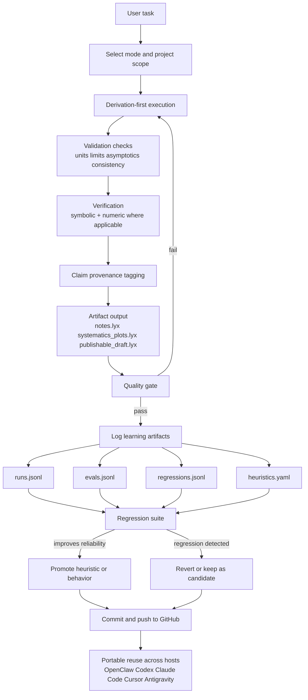

# QCHI

Standalone, portable research operating layer for rigorous theoretical-physics workflows.

## Canonical Goal
Build one reusable system that works across hosts (OpenClaw, Antigravity, Cursor, OpenCode, generic LLM interfaces) while preserving rigorous behavior.

## Canonical docs
- `docs/PROJECT_INTENT.md` (source of truth)
- `docs/TOP_LAYER_PORTABLE_SPEC.md`
- `docs/WORKFLOW_PORTABLE.md`
- `docs/PORTABILITY_PLAN.md`

## Portable skill package
- `skills/qchi-r/`
- OpenClaw package output: `dist/qchi-r.skill`
- Generic package output: `dist/qchi-r-portable.zip`

## End-to-end flow (v1)

## Quick map
- Core skill: `skills/qchi-r/SKILL.md`
- Learning store: `skills/qchi-r/learning/`
- Rigor policies: `skills/qchi-r/references/`
- Quality gate: `skills/qchi-r/checklists/QUALITY_GATE.md`
- Rust lint scaffold: `tools/qchi-lint/`
- CI workflow: `.github/workflows/qchi-lint.yml`
