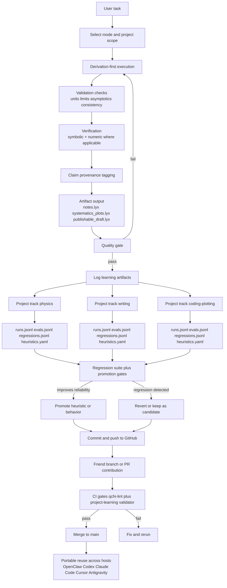

# QCHI

Standalone, portable research operating layer for rigorous theoretical-physics workflows.

## Canonical Goal
Build one reusable system that works across hosts (OpenClaw, Antigravity, Cursor, OpenCode, generic LLM interfaces) while preserving rigorous behavior.

## Canonical docs
- `docs/PROJECT_INTENT.md` (source of truth)
- `docs/TOP_LAYER_PORTABLE_SPEC.md`
- `docs/WORKFLOW_PORTABLE.md`
- `docs/PORTABILITY_PLAN.md`
- `docs/INSTALL_AND_USE.md` (how to install and run)
- `docs/INSTALL_PREREQS.md` (program prerequisites)
- `docs/HOST_COMMANDS.md` (host-by-host command quickstart)
- `docs/OPENCODE_REGISTER.md` (register QCHI in OpenCode)

## Portable skill package
- Source of truth: `skills/qchi/`
- Dist artifacts are generated snapshots under `dist/` (names may vary by build history)
- Rebuild/export artifacts from current `skills/qchi/` before release

## End-to-end flow (v1)

## Quick map
- Core skill: `skills/qchi/SKILL.md`
- Learning store: `skills/qchi/learning/`
- Project learning layout: `skills/qchi/references/LEARNING_PROJECT_LAYOUT.md`
- Rigor policies: `skills/qchi/references/`
- Quality gate: `skills/qchi/checklists/QUALITY_GATE.md`
- Rust lint scaffold: `tools/qchi-lint/`
- CI workflow: `.github/workflows/qchi-lint.yml`
